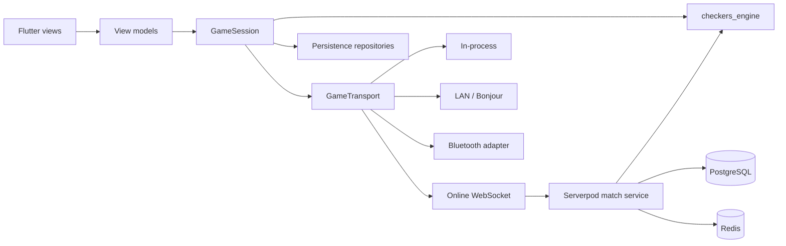

# Architecture

## System view



Dependencies point inward. Flutter widgets, database drivers, Bluetooth APIs,
and sockets cannot be imported by `checkers_engine`. The server and client run
the same rules code, but the server remains the authority for online matches.

## Client boundaries

The mobile application will use feature-first modules with consistent internal
layers:

```text
lib/
  app/                 bootstrap, routing, theme, dependency wiring
  core/                errors, clocks, accessibility, shared UI primitives
  features/
    game/              view, view-model, board presentation
    single_player/
    story/
    local_multiplayer/
    online_multiplayer/
    profile/
    settings/
```

- Views render state and forward user intent.
- View-models coordinate use cases and expose immutable presentation state.
- Repositories are domain-facing sources of truth.
- Services adapt SQLite, secure storage, platform APIs, audio, haptics, and the
  generated backend client.

## Game engine structure

`checkers_engine` is a deterministic state transition library:

```text
GameState + GameCommand
          |
          v
RulesEngine.validateMove
          |
          v
Capture policy -> promotion policy -> win/draw policy
          |
          v
new GameState + domain events
```

Core concepts are `BoardPosition`, `Piece`, `Board`, `Move`, `GameState`,
`RulesetDescriptor`, `RulesEngine`, `MoveValidation`, and `GameOutcome`. A move
stores its complete landing path, not just origin and destination, so ambiguous
multi-captures can be represented and replayed exactly. `GameReplayer` sends
every recorded move back through its rules engine and rejects illegal moves or
transitions that do not advance revision and ply exactly once.

Ruleset implementations will compose movement, capture-selection, promotion,
and draw policies. They will not branch on ruleset names inside one large
validator. State serialization is versioned, canonical, and hashable for
reconnect checks and deterministic replay. The position hash excludes piece
identities and move counters so equivalent positions can be compared for
repetition. The snapshot hash includes identities, counters, status, and
outcome so synchronization can detect any authoritative-state drift.
`GameState` also carries immutable position history and namespaced ruleset
counters. These fields are included in schema-v2 snapshots and allow draw rules
to remain deterministic across saves, replays, and reconnects.

## One session model for every mode

Every UI uses `GameSession`. It exposes the current state, an ordered update
stream, command submission, reconnect, and close. The authority changes by mode;
the view-model does not.

The Phase 5 in-process implementation is the first concrete authority. It owns
the rules engine and current state, maps local seat actors to sides, rejects
unauthorized or stale commands, deduplicates command IDs, and emits one ordered
update for every accepted action. The board view-model consumes session state
and legal moves without importing or constructing a rules engine. Draw offers
are session state rather than board state; resignation and accepted draws create
terminal `GameState` snapshots without adding a gameplay ply.

| Mode | Authority | Transport/actor |
| --- | --- | --- |
| Same-device | Current device | In-process reducer |
| AI | Current device | In-process reducer plus isolated AI actor |
| Story | Current device | In-process reducer plus challenge evaluator |
| LAN | Host device | Reliable socket transport; guest submits intent |
| Bluetooth | Host device | Platform Bluetooth transport; guest submits intent |
| Online | Server | Authenticated WebSocket transport |

Nearby and online transports carry the same versioned envelopes. Each envelope
has a message ID, match ID, actor ID, protocol version, sequence, type, payload,
and optional state hash. Commands are idempotent. The authority assigns event
sequence numbers, rejects stale/illegal intent, and periodically emits a full
snapshot. A reconnect sends the last acknowledged sequence and state hash; the
authority returns missed events or a replacement snapshot.

LAN discovery is separate from match transport. Android uses Network Service
Discovery/nearby permissions; Apple platforms use Bonjour with Network
framework. Current Apple guidance deprecates Multipeer Connectivity in Xcode 27,
so the adapter must not make it a long-term foundation:

- [Apple: moving from Multipeer Connectivity to Network framework](https://developer.apple.com/documentation/technotes/tn3213-moving-from-multipeer-connectivity-to-network-framework)
- [Android nearby Wi-Fi permissions](https://developer.android.com/develop/connectivity/wifi/wifi-permissions)
- [Android Bluetooth permissions](https://developer.android.com/develop/connectivity/bluetooth/bt-permissions)

## Backend and database

Serverpod hosts authenticated endpoints and match streams. A match actor owns
each live game and serializes commands, preventing concurrent double moves.
PostgreSQL is durable truth; Redis supports ephemeral queues, leases, presence,
rate limiting, and cross-instance fan-out. A lease ensures exactly one server
instance owns a live match at a time.

Main relational groups:

| Group | Tables |
| --- | --- |
| Identity | `users`, `profiles`, `devices`, `sessions` |
| Social | `friendships`, `invitations`, `blocks` |
| Matches | `matches`, `match_players`, `match_events`, `match_snapshots`, `draw_offers` |
| Competition | `ratings`, `rating_events`, `seasons`, `leaderboard_snapshots` |
| Progression | `story_progress`, `level_progress`, `achievement_definitions`, `user_achievements` |
| Operations | `sync_operations`, `audit_events`, `moderation_actions` |

Important invariants:

- `(match_id, sequence)` and command IDs are unique.
- Rating mutations and match finalization share one transaction.
- Match events are append-only; snapshots are derived accelerators.
- Client-supplied scores, ratings, results, elapsed time, and unlocks are never
  accepted as facts.
- Offline sync operations carry stable IDs and can be safely retried.
- Personal data and gameplay telemetry have explicit retention policies.

## Clock and reconnection model

The authority stores remaining durations and a monotonic turn-start instant.
Clients render an estimate from server time samples but cannot declare timeout.
On backgrounding or disconnect, policy determines whether the authoritative
clock continues. Reconnect first authenticates the actor, then resumes from the
last acknowledged event. Duplicate events are discarded by sequence/message ID;
gaps force replay or snapshot replacement.

## AI boundary

AI consumes an immutable `GameState` and legal moves from the same rules engine.
It returns a move plus search metadata. Beginner play may sample legal moves;
higher levels use iterative-deepening minimax/alpha-beta, transposition tables,
move ordering, evaluation weights, and endgame knowledge. Search runs in an
isolate with time/node/cancellation budgets so UI work is never blocked.

`checkers_ai` is an outer pure-Dart package that depends on `checkers_engine`;
the engine never depends on AI code. Strategies receive copied legal-move lists,
validated resource budgets, and cancellation tokens. Results contain the chosen
move plus strategy ID, nodes examined, completed depth, elapsed duration, and a
stop reason. Random strategies require an explicit seed so tests and profiles
can reproduce their move sequence.

Static evaluation is expressed as explicit material, uncrowned advancement,
center-control, active-side mobility, and terminal terms. Every evaluation is
from a requested player's perspective, and terminal wins/losses dominate the
combined heuristic weights.
